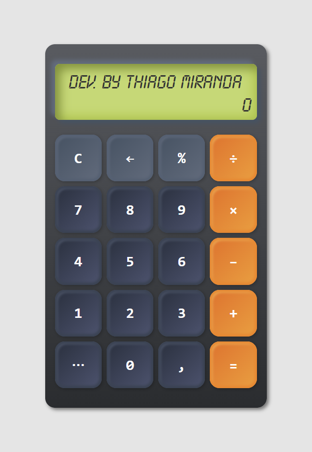
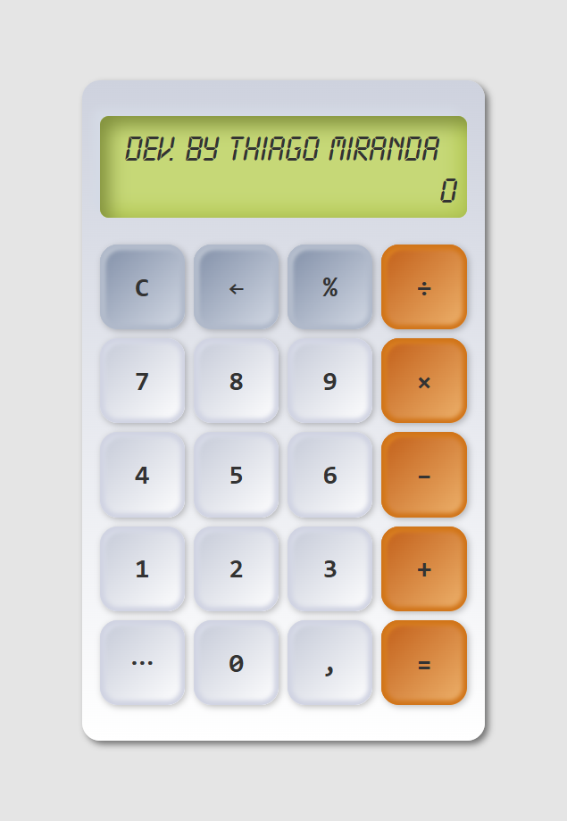

### **DESAFIO DE PROJETO:**

# React Calculator

<h4 align="center">

**Criado e desenvolvido por:** _Thiago de Oliveira Miranda_

</h4>

## Escopo do projeto

Projeto desenvolvido na formação React Developer da DIO. Consiste na criação de uma aplicação de calculadora das quatro operações matemáticas básicas utilizando o React. O objetivo é explorar os conceitos de componentes e os **React Hooks**.

 

### `Resultado`

Figura 01 e 02: Telas do projeto.

O design proposto segue a vertente minimalista com visual limpo para fácil compreensão.

 

### `Implementações`

- [x] Visor para a visualização das expressões matemáticas;
- [x] A função de porcentagem foi implementada;
- [x] Inserção e operação de números negativos;
- [x] Inserção e operação de números decimais;
- [x] Botão de troca de temas;
